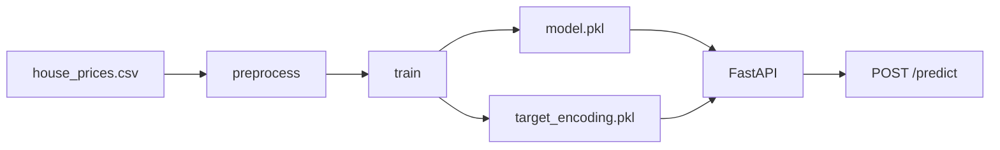
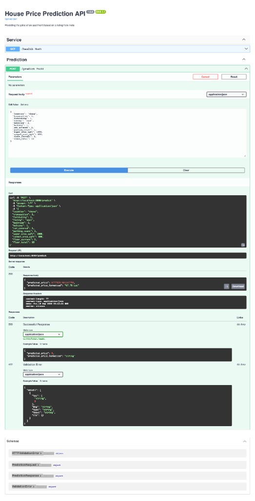

# House Price Prediction

Регрессия стоимости жилья по объявлениям из Индии: от EDA и предобработки до обученной модели и HTTP API.

## О проекте

Проект предсказывает полную цену квартиры (`amount`) по признакам объявления: город, площадь, этаж, парковка, мебель, тип сделки.

Датасет — [House Price](https://www.kaggle.com/datasets/juhibhojani/house-price) на Kaggle (`juhibhojani/house-price`): **187 531** объект и **21** признак. В сырых данных цена записана как строки вида `42 Lac` / `1.40 Cr`; цена за квадрат (`price`) в модель не идёт, чтобы не было утечки.

Цель — воспроизводимый пайплайн: очистка → обучение Random Forest → артефакты → FastAPI для инференса.

## Результаты

Hold-out 80/20, `random_state=42`, таргет в `log1p`, метрики на исходной шкале в рупиях. Итоговая модель в сервисе — **Random Forest** (Optuna: 180 деревьев, `max_depth=25`).

| Модель | MAE | R² | MAPE |
| --- | ---: | ---: | ---: |
| **Random Forest** (итоговая) | 799 909 | 0.9414 | **8.93%** |
| LightGBM (Optuna) | 841 123 | 0.9416 | 9.39% |
| CatBoost | 928 719 | 0.9380 | 10.29% |

Повторный прогон RF в этом репозитории даёт MAE ≈ 800 058, R² 0.9414, MAPE 8.92% — расхождение в пределах версии sklearn/pandas.

## Архитектура

```text
Kaggle CSV
    → src/preprocess.py     очистка, парсинг цены/площади/этажа
    → src/train.py          TargetEncoder(location) + RF pipeline
    → model/*.pkl           model.pkl, target_encoding.pkl
    → FastAPI /predict      инференс, ответ в rupees / Lac / Cr
```



## Стек

- **Python** 3.14, pandas, numpy
- **scikit-learn** — Random Forest, ColumnTransformer, One-Hot, импутация
- **category_encoders** — target encoding для `location`
- **Optuna** — подбор гиперпараметров (в лабораторной работе)
- **LightGBM / CatBoost** — сравнение, в прод не входят
- **FastAPI + uvicorn + pydantic** — HTTP API
- **joblib** — сериализация артефактов
- **Docker** — `python:3.14-slim`, при сборке качает датасет, обучает RF и поднимает API
- **pytest** — проверка `/health`, структуры `/predict` и валидации `transaction`

## Структура проекта

```text
house_pricing_ml/
├── app/                  FastAPI-сервис
│   ├── main.py           /health, /predict
│   ├── schemas.py        pydantic-схемы запроса и ответа
│   └── model_loader.py   загрузка pkl при старте
├── src/
│   ├── preprocess.py     загрузка CSV и очистка
│   └── train.py          обучение RF и сохранение артефактов
├── tests/
│   └── test_api.py       pytest для FastAPI
├── data/                 сырой датасет (не в git)
│   └── house_prices.csv
├── model/                model.pkl, target_encoding.pkl (не в git)
├── notebooks/            исходные эксперименты
├── report/               отчёт по лабораторной
├── docs/                 скриншоты для README
├── Dockerfile
├── .dockerignore
├── requirements.txt
└── README.md
```

CSV и `.pkl` в git не коммитятся: датасет качается с Kaggle, модель собирается через `python -m src.train` или при `docker build`.

## Как запустить

### Локально

Нужны Python 3.14 и файл `data/house_prices.csv` (Kaggle: `juhibhojani/house-price`).

```bash
python -m venv .venv
source .venv/bin/activate
pip install -r requirements.txt

python -m src.train          # метрики + model/model.pkl и model/target_encoding.pkl
python -m app.main           # API на http://127.0.0.1:8000
```

Без активации venv:

```bash
.venv/bin/python -m src.train
.venv/bin/python -m app.main
```

Swagger UI: [http://127.0.0.1:8000/docs](http://127.0.0.1:8000/docs)

### Тесты

Модель для тестов не нужна: подставляется заглушка.

```bash
PYTHONPATH=. python -m pytest tests/test_api.py -v
```

Проверяются код 200 у `GET /health`, поля ответа `POST /predict` и 422 при `transaction` вне `{0, 1}`.

### Через Docker

Сборка качает датасет с Kaggle, обучает Random Forest внутри образа и кладёт `model/*.pkl` туда же. Первый `docker build` занимает несколько минут.

```bash
docker build -t house-pricing-ml .
docker run --rm -p 8000:8000 house-pricing-ml
```

API: [http://127.0.0.1:8000](http://127.0.0.1:8000), Swagger: [http://127.0.0.1:8000/docs](http://127.0.0.1:8000/docs).

Проверка: `GET /health` → `{"status":"healthy"}`. В собранном образе RF даёт MAPE 8.92%, как локальный прогон.

## API

- `GET /health` — сервис жив и модель загружена
- `POST /predict` — цена в рупиях и в формате Lac/Cr
- Интерактивная схема: `/docs` (Swagger)



Пример запроса:

```bash
curl -X POST http://127.0.0.1:8000/predict \
  -H "Content-Type: application/json" \
  -d '{
    "location": "thane",
    "transaction": 1,
    "furnishing": 1,
    "facing": "east",
    "bathroom": 2,
    "balcony": 1,
    "car_covered": 1,
    "parking_count": 1,
    "super_area_sqft": 950,
    "carpet_area_sqft": 750,
    "floor_current": 10,
    "floor_total": 22
  }'
```

Пример ответа:

```json
{
  "predicted_price": 8500000.0,
  "predicted_price_formatted": "85.00 Lac"
}
```

`transaction`: `0` — resale, `1` — new property.  
`furnishing`: `0` unfurnished, `1` semi-furnished, `2` furnished.  
`facing`: `"east"`, `"west"`, `"missing"` и т.д.  
Площадь и этаж можно передать как `null`.

## Что можно улучшить

- docker-compose, чтобы не помнить флаги `docker run`
- Убрать подбор гиперпараметров по тестовой выборке (Optuna в лабораторной смотрел на test)
- Честный CV / отдельный validation split перед финальным тестом
- Более аккуратная обработка пропусков площади (сейчас часть строк с NaN площади остаётся)
- Признаки из текста объявления и более сильный энкодинг локаций
- Больше тестов: препроцессинг, контракт Docker-образа
- Версионирование артефактов модели и простой мониторинг качества на новых данных
